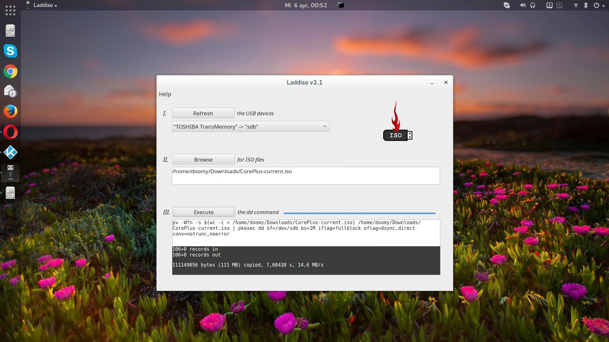

# Laddiso
Lazarus-based simple interface to dd GNU/Linux command
for writing iso files to usb devices on GNU/Linux

v2.1 April 5th, 2016

## Change log
* Using polkit for executing the dd command under elevated credentials: `pkexec`.
* Using PipeViewer to track the progress of written data: `apt-get install pv`.
* Getting realtime output feedback using: `Application.ProcessMessages`.
* Larger main form.

